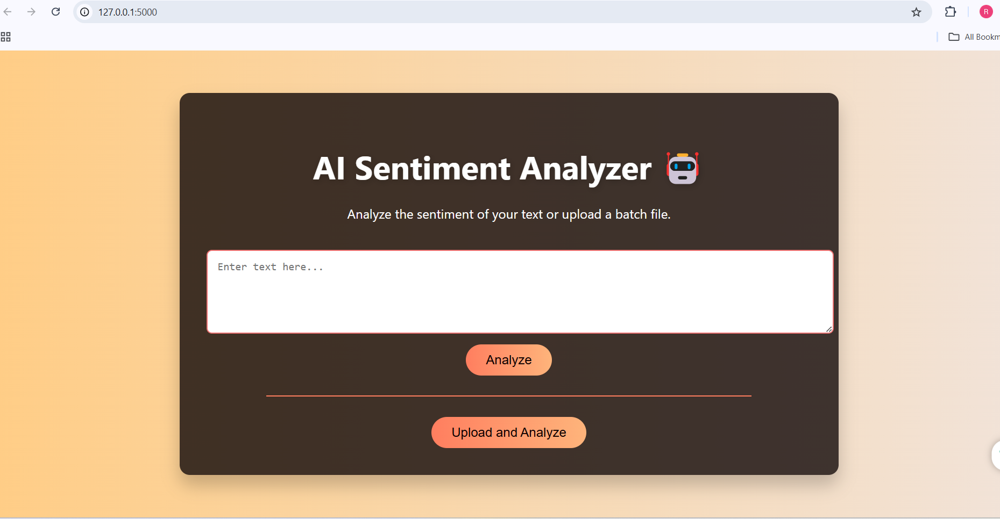
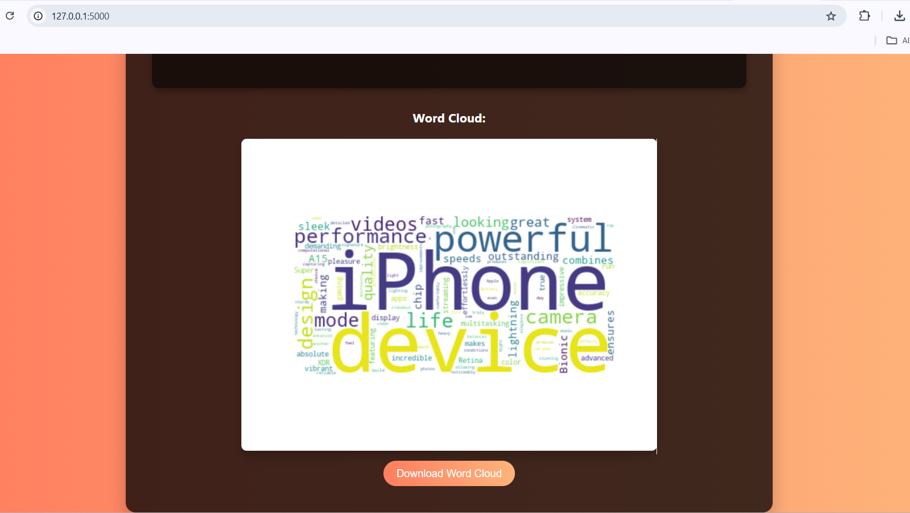
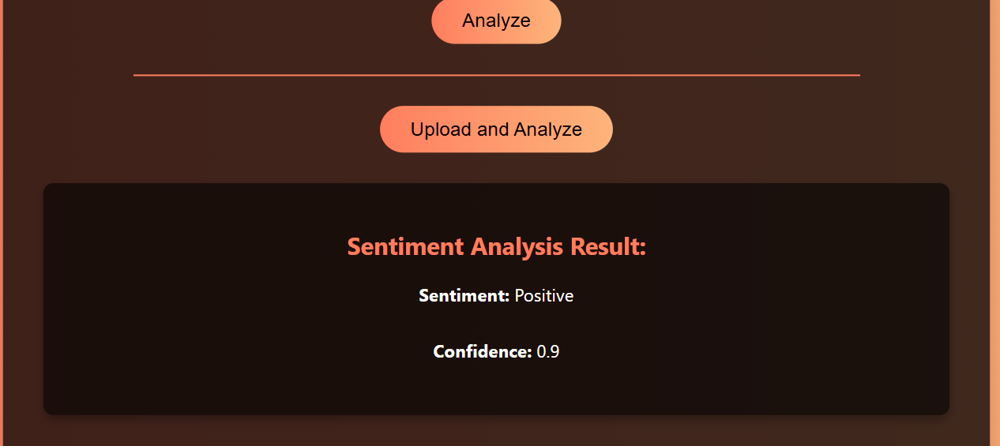

# AI Sentiment Analyzer using Flask & Google Gemini

AI Sentiment Analyzer is a web-based application built using **Flask** that analyzes the sentiment of text input or batch files. It uses Google's **Gemini AI** for advanced sentiment analysis to determine whether the sentiment is positive, negative, neutral, or mixed. The application also generates word clouds and includes a conversational chatbot feature.

### Application Interface
Here's a screenshot of the application's interface:

### Word Cloud Example
Below is an example of the generated word cloud:

### Sentiment Result
Here is a screenshot of the application's output:

## Features
- **Text Sentiment Analysis**: Analyze the sentiment of single text input with confidence scores
- **Batch Sentiment Analysis**: Upload CSV, TXT, or Excel files for batch processing (up to 100 entries)
- **Multiple File Formats**: Support for .csv, .txt, .xlsx, and .xls files
- **Word Cloud Generation**: Visualize the most frequent words in your text
- **Download Word Cloud**: Save generated word clouds as PNG files
- **Interactive Chatbot**: Conversational AI assistant for general queries
- **Responsive Design**: Modern, mobile-friendly interface
- **Real-time Processing**: Instant results with progress indicators

## Technologies Used
- **Flask**: Web framework for the application backend
- **Google Gemini AI**: Advanced language model for sentiment analysis
- **Langchain**: Framework for LLM integration and prompt management
- **Python**: Core programming language
- **Pandas**: Data processing for batch analysis
- **Matplotlib & WordCloud**: Visualization libraries
- **Bootstrap/CSS3**: Frontend styling and responsiveness
- **JavaScript**: Interactive frontend functionality

## Installation

### Prerequisites
1. Python 3.11 or higher
2. Google Gemini API key (get it from [Google AI Studio](https://makersuite.google.com/app/apikey))
3. `pip` for installing Python dependencies

### Quick Setup

